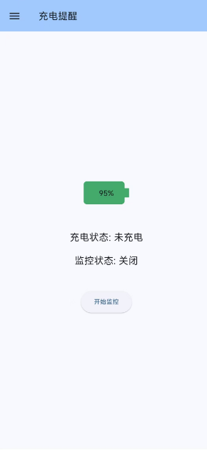
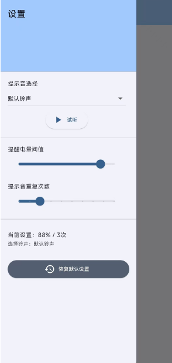

# battery_notify

一个自定义充电达到 xx% 时，提醒用户拔掉手机充电器。

- 自定义提醒电量阈值

- 自定义循环提醒次数

- 自定义提醒铃声

## Getting Started

```shell
# 安装依赖
flutter pub get

# 打包
flutter build apk
```

或

直接使用`app-release.apk`

## Demo




